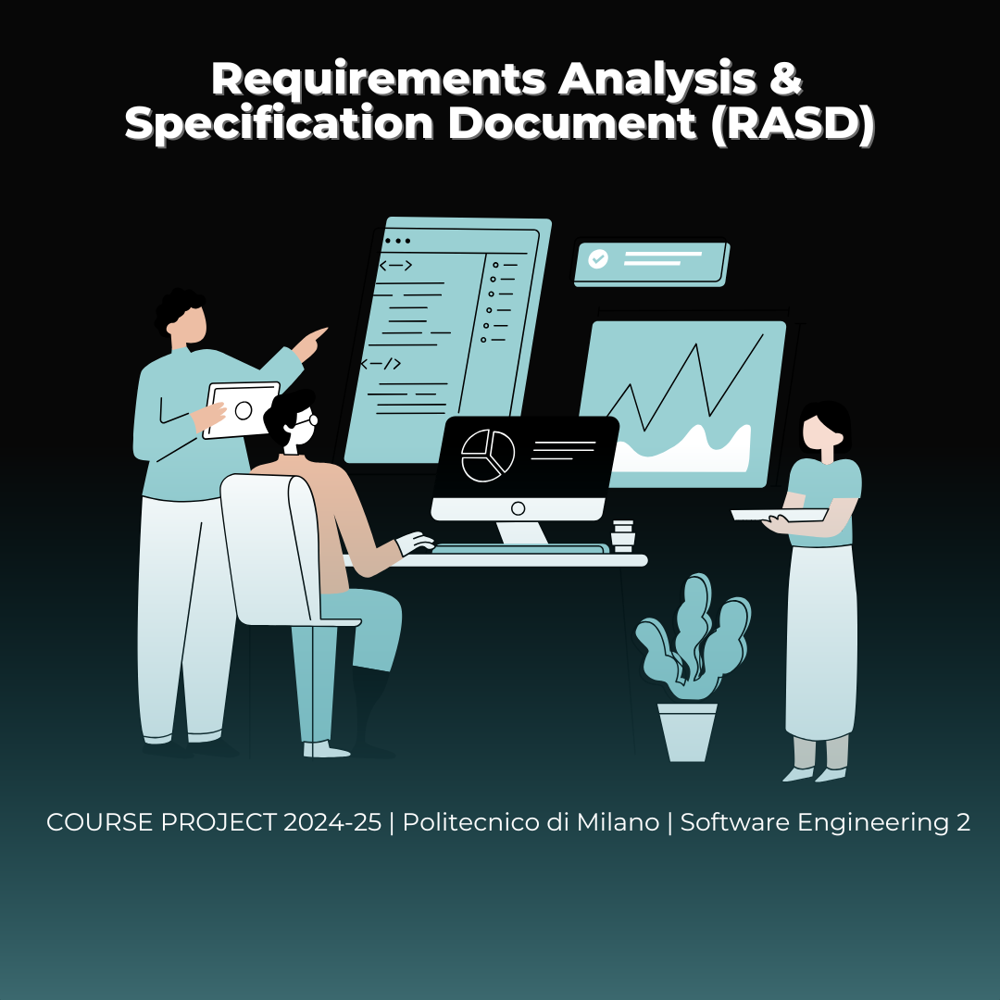
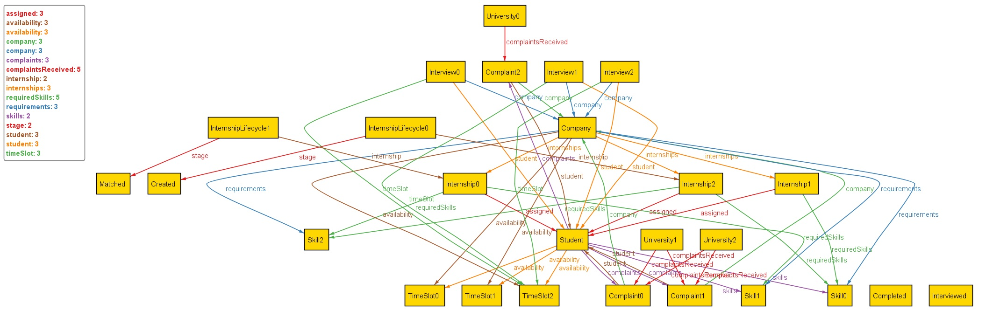
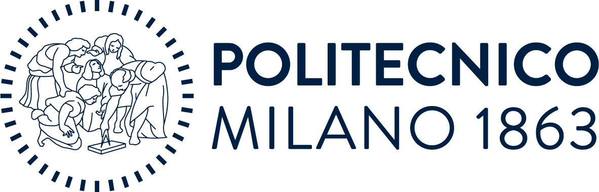

  

# 💼 Students&Companies (S&C) Platform

**Project Type:** Requirement Engineering and Design Project  

---

## 📌 Project Overview

The **Students&Companies (S&C)** platform aims to connect **university students seeking internships** with **companies offering internship opportunities**. It facilitates seamless interaction between both parties by supporting internship listings, CV uploads, intelligent recommendations, feedback mechanisms, and end-to-end internship tracking — including complaint handling by universities.

This project involves two key components:
 - ### 📘 RASD - Requirements Analysis and Specification Document

    - Use case diagrams, scenarios, and formal Alloy model
    - Domain model with UML class and state diagrams
    - Specification of functional, non-functional, and performance requirements
    - Transparent effort tracking of all group members

 - ### 📙 DD - Design Document

    - Architectural design (component, deployment, and runtime views)
    - Interface specifications and design patterns applied
    - UI design overview and traceability matrix
    - Integration and testing strategy
    - Development roadmap and team workload distribution

---

## 🔍 Project Goals

- Define clear and complete software requirements through structured scenarios and formal models
- Design a scalable system architecture that supports matchmaking, recommendation, feedback, and monitoring
- Apply best practices from UML, natural language analysis, and formal Alloy modeling
- Simulate real-world software engineering documentation and project collaboration

---
## 🧩 Formal Modeling with Alloy 6

To validate and specify the core constraints of the system, we used the [**Alloy 6** modeling tool](https://alloytools.org/).

Alloy provided a lightweight formal specification language for:

- Defining system **entities** and **relations**
- Expressing **constraints** and **invariants** clearly
- Performing **automated analysis** via the Alloy Analyzer to check model consistency

> Alloy modeling helped us catch ambiguities and refine requirements early in the process.
---
## 🎓 Academic Affiliation

**Team Members:**  
- Dorsa Motiallah  
- Sujata Chaudhury  
- Darkhan Islam

This project was developed as part of the **Software Engineering 2** (A.Y. 2024–2025) course at  
**Politecnico di Milano** (*PoliMi*), Italy  
**Course Instructor:** Prof. Matteo Rossi  
**Lab Assistant:** Alberto Tagliaferro  

---

## 🛠 Tools & Technologies

- **Modeling**: UML (StarUML, Draw.io), Alloy Analyzer
- **Writing**: Overleaf / LaTeX for professional PDF generation
- **Version Control**: Git + GitHub (private repo)
- **Collaboration**: GitHub Issues, commit history, and shared workload

---
